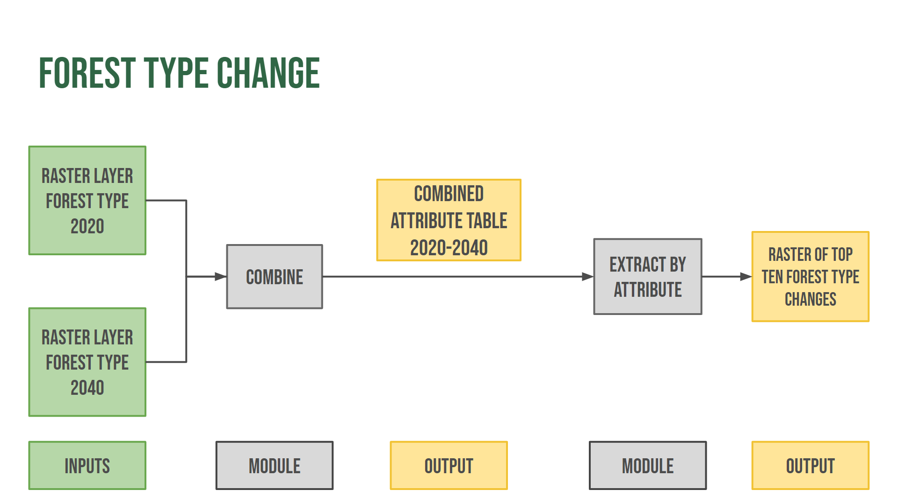

```{r setup, include=FALSE}
knitr::opts_chunk$set(echo = TRUE)
```

### Goal: Find top ten greatest changes in land use from 2020-2040 within the Tahoe Central Sierra region

**Module/Function 1: combine function**

-   Input: rasters layers (forest type for 2020 and 2040)

-   Parameter: Combine by `forest type` column

-   Output: combined raster into 2020-2040 attribute table

**Module 2: extract by attribute function**

-   Input: combined raster attribute table from module 1

-   Parameters: filter for top ten largest pixel count

-   Output: top ten greatest changes in land use from 2020-2040

